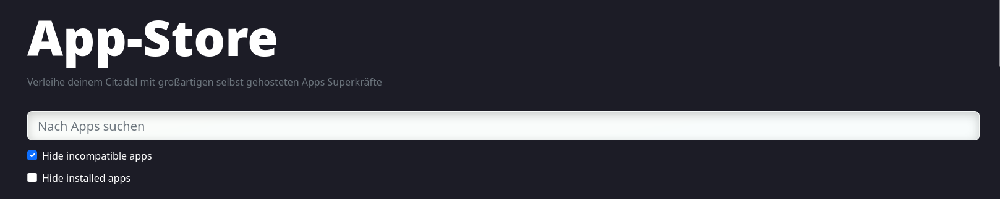

Citadel 0.1.0 is finally finished. While some stuff that was originally planned is still missing, there's a lot of new things.

## Redesigning our app system

The way apps on Citadel work has been completely changed. I'll list some of the noticeable changes below.

### Moving electrs to the app store

With this new update, we've started removing removing a previous concept called "services" from Citadel and integrating it into the app system.

A "service" on Citadel could be something like Bitcoin Core or Electrs. Both implement standardized protocols and could be replaced by other tools (Bitcoin Knots, btcd, Fulcrum, ElectrumX, ...).

Services never had an user interface and relied on being managed via SSH. In addition, services were shipped with Citadel and could not be updated easily. They also did not have the safety guarantees of our app system, which ensures permission management and app isolation.

This means that in Citadel 0.1.0, we've prepared the basics for removing services by moving Electrs to the app store. You can easily install either Fulcrum or Electrs with one click. 

This is built on what we called "virtual apps". Virtual apps are apps that do not exist directly, but are provided by another app. For example, an app may depend on "Electrum", but an app named "Electrum" does not exist on Citadel. Instead, Electrum automatically refers to the current Electrum server.

Virtual apps increase the capabilities of our app system and will allow some exciting new things in the future.

### Preprocessing app files

While this mostly affects developers, it will still have an user impact later on.

For those of you wo are familiar with Umbrel 0.5.0, they decided to move Bitcoin Core, LND and Electrs to the app store.

However, Umbrel has a very simple and insecure app system. It does not allow apps to behave differently with different dependencies.

Citadel's latest app system allows app developers to write if statements in a jinja-like syntax in their app files. This means that while on Umbrel, you may have "Ride the Lightning (LND)" and "Ride the Lightning (Core Lightning)" or "Node-RED (No bitcoin)" and "Node-RED (With bitcoin access)", you'd just have "Ride the Lightning" and "Node-RED" on Citadel, and they'd work differently depending on what other apps you have installed.

This helps keep the app store clean and avoid confusion.

### Cleaner app store UI

With our app store growing, it becomes harder to find the apps you like in it.

To avoid this, we've made a few optimizations to how the app store looks.

Apps that are incompatible (and you couldn't install anyway) are now hidden by default. This means you won't have to click on an app, see the "Incompatible" notice and have to go back.

In addition, you can now hide already installed apps in one click. This means that you can browse the app store and find new apps more easily.

Finally, we've added a search bar to the app store so you can quickly search for any app. 

We're planning to improve the user experience in this area further in upcoming updates.

## Localizing our dashboard

While a lot of changes to prepare Citadel for translations have already been available for some time, we've made a few more improvements to make Citadel more accessible for the international community.

Citadel has always shown the wallet balance in Sats/BTC and in USD. A lot of European users have asked if we could also allow to use Euro instead.

So in the latest release, Citadel automatically detects your country and local currency based on browser settings.

## Visual improvements

The update notification has been redesigned in this update. While previously being present on the dashboard at all times, you can now simply close it if you don't want to update.

We've also made a lot more minor visual improvements, and a lot more are coming with the next few updates.

## Adding back uptime

The dashboard displays your node's uptime again. So you can see how long your node has been online for.

## Speed improvements

### Cleaning up the dashboard

By removing a lot of legacy code, we could make the Citadel dashboard a lot faster. While previously, a lot of users reported it being slow or even causing their browser tab to hang completely, we've optimized our dashboard in this release to increase its speed considerably.

### Porting the manager to Deno

Porting [manager](https://github.com/runcitadel/manager) to Deno has also helped a lot with improving the speed of Citadel.

### Skipping app generation

Previous versions of Citadel loaded and converted all app.yml files during every update and every time Citadel was started.

By only doing this when apps actually change, we could improve the start speed by a lot.

### Starting apps after updates

You should now be able to access the Citadel dashboard during updates while new apps are still starting or being downloaded.

## A look into the future

With Citadel's new app system, these changes are planned for Citadel 0.1.1:

- **Move Bitcoin Knots to the app store**: To allow easy switching between Bitcoin Core, Bitcoin Knots and BTCD, the next Citadel update will move Bitcoin Knots to the app store. Unlike Umbrel, Bitcoin Features will still stay part of the Citadel dashboard though
- **Modularity**: Automated channel backups, previously a part of Citadel will be moved to the app store and can be uninstalled. This ensures you can cut any connection to our server if you don't want it (although this feature is fully anonymous and secure).
- **UI Improvements**: We've made a lot of UI tweaks in this release, but there's still a lot coming up.
- **Finalize update channels**: You should be able to switch to the Citadel beta easily from the dashboard.

