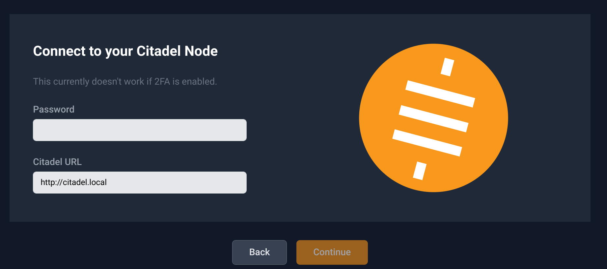
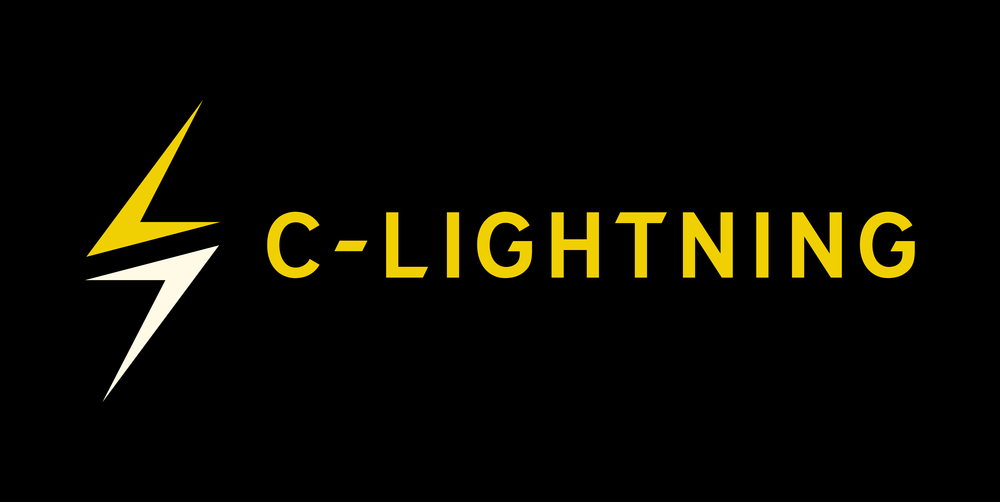
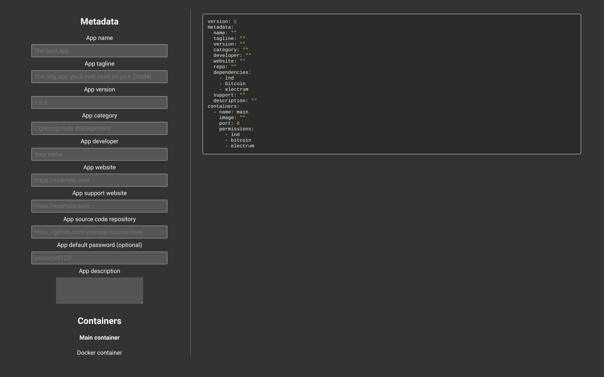
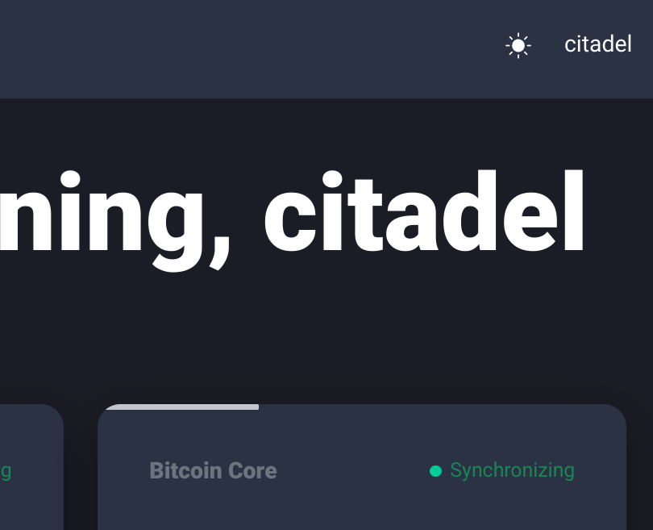
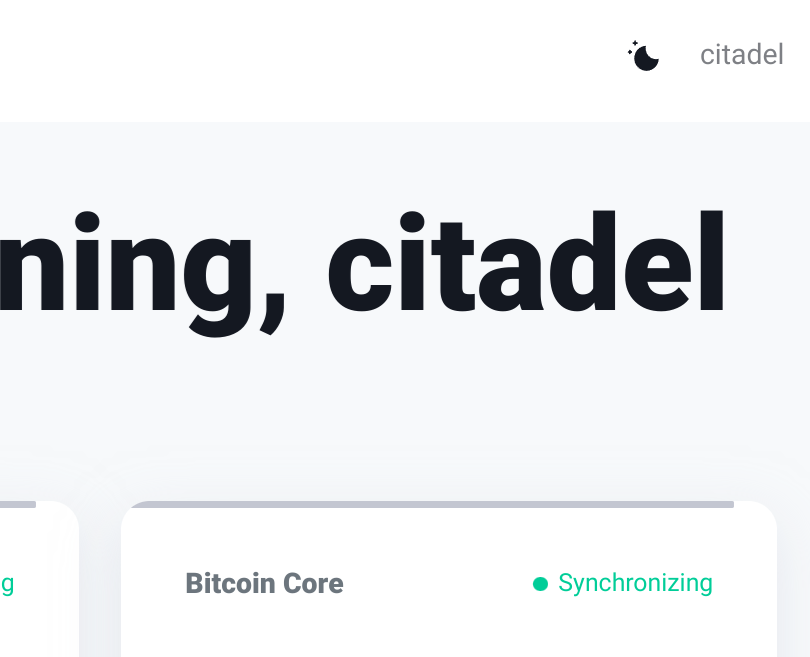

This is a new series where we will try to post what we did the previous week in Citadel and what's coming next.

This is the first post in the series to check if we should write such a post weekly and what we could improve.

I'll start with this week's progress.

## Summary

This week, we

- Launched a Citadel connector in Alby
- Successfully connected to c-lightning on Citadel from Alby
- Started working on a new Liquid integration
- Started a new app builder
- Launched a new blog
- Started working on a new OS
- Implemented a new dark mode toggle for the dashboard
- Fixed multiple bugs

## 🐝 Alby integration

This week, the [Alby](https://getalby.com) team launched a new release. This release made it much easier to connect your Alby to Citadel.

Internally, this utilizes [the Citadel SDK](https://github.com/runcitadel/sdk), a tool to make it easier for the developers to integrate a Citadel connection into their app.

This SDK is also used in the Citadel dashboard and our upcoming new UI, so all have the same base and there is less room for implementation-specific bugs.

You can connect your Citadel to Alby by simply entering your Citadel's local URL (citadel.local) or onion URL and your Citadel password into Alby.

This is much simpler than the other connectors, because you do not need to log into the dashboard and copy a value first. It will also work no matter what Lightning implementation you use on your Citadel, all will work:

- LND
- (Beta) c-lightning
- _Soon (?)_ Eclair

## c-lightning progress

For c-lightning, we built our own library to make it easier for developers to integrate c-lightning into their application.

It started as a simple TypeScript client for c-lightning, automatically generated from the c-lightning documentation.

This week, we improved the way this library, called c-lightning.ts, to work better with the c-lightning REST plugin.

The c-lightning REST plugin is used by apps like Ride the Lightning and will make it possible to connect to c-lightning from another device, like your phone.

We hope that this change will make it easier for developers of mobile wallets and other apps to integrate c-lightning.

## Liquid

We also started working on implementing a [Liquid](https://liquid.net) node on Citadel. This will allow you to put your Bitcoin onto the Liquid Sidechain, and also verify funds you may receive over Liquid.

This will also soon allow block explorers like mempool.space on your Citadel to be connected to your Citadel.

So far, we only got the core [Elements daemon](https://github.com/ElementsProject/elements) dockerized and running on Citadel, but a lot more is planned for it during the next few weeks.

## App builder

We're also working on a new tool to make it easier for app developers to create apps for Citadel.

Right now, it is pretty simple, but it allows developers to get started with our app.yml format faster.

A demo is available [here](https://app-builder.runcitadel.space/). However, it is still in beta and a lot more features are planned to be added there. This is just an initial concept for basic apps and will be a lot cooler once we got a full developer portal (That's also something coming soon, but I won't explain it in more detail yet).

## Manjaro-based OS

Another thing we've started working on is porting our OS to a manjaro-arm base. Our current codebase has multiple issues which make it hard to maintain and also make it nearly impossible to port it to devices other than the Raspberry Pi.

The new OS, based on Manjaro, will also work on the Rockpro, Quartz64 (A and B) and a lot of other arm-based devices, especially those from [Pine64](https://www.pine64.org/).

## Dark mode toggle

This week, [@pwltr](https://github.com/pwltr) also implemented the toggle in the screenshot above.
Previously, whether your Citadel dashboard was shown in dark mode depended on your browser settings.
With this new option, you can now choose it directly on the dashboard.
